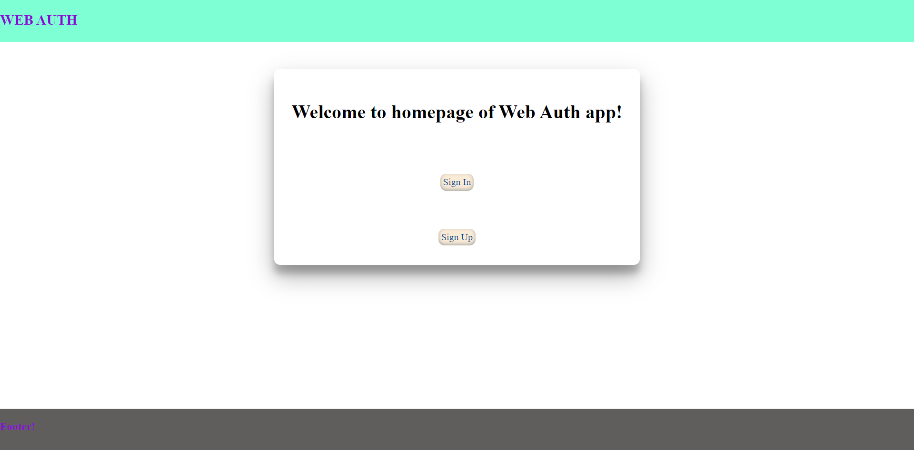
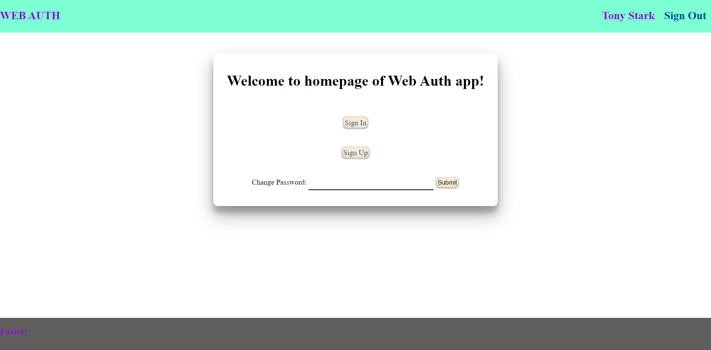
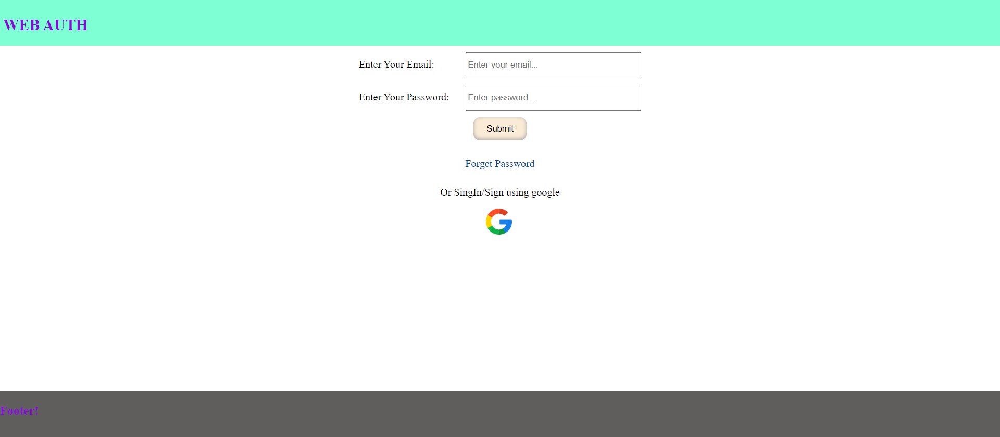
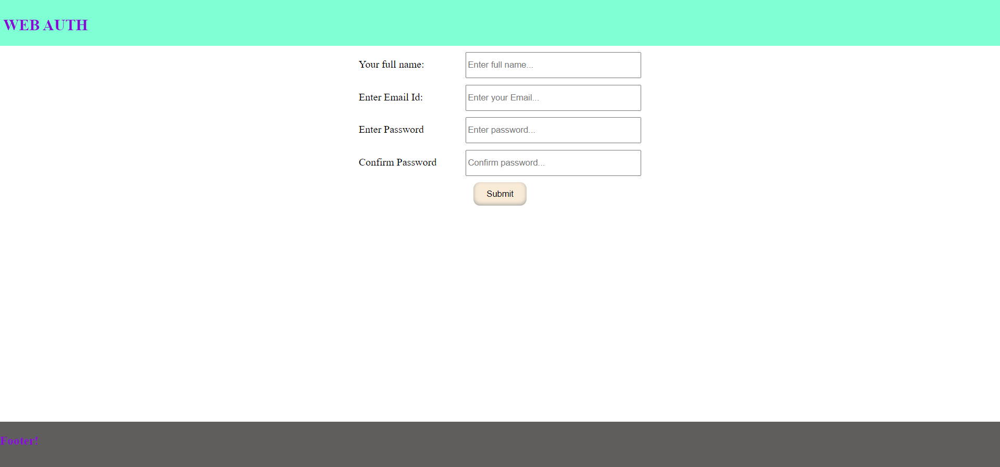
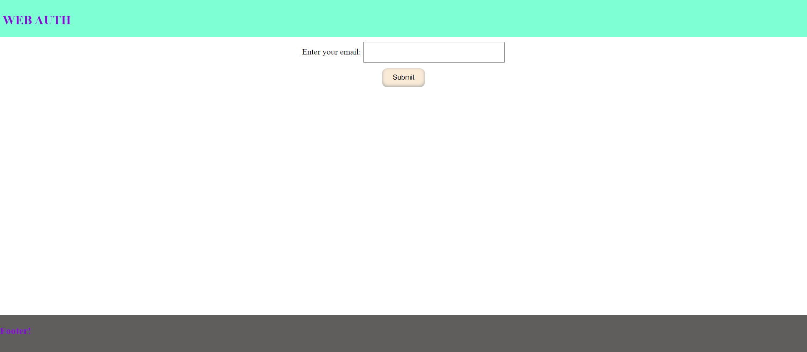
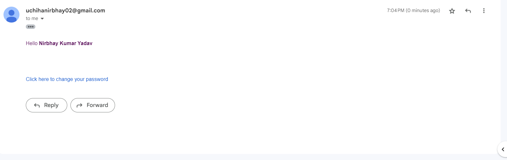
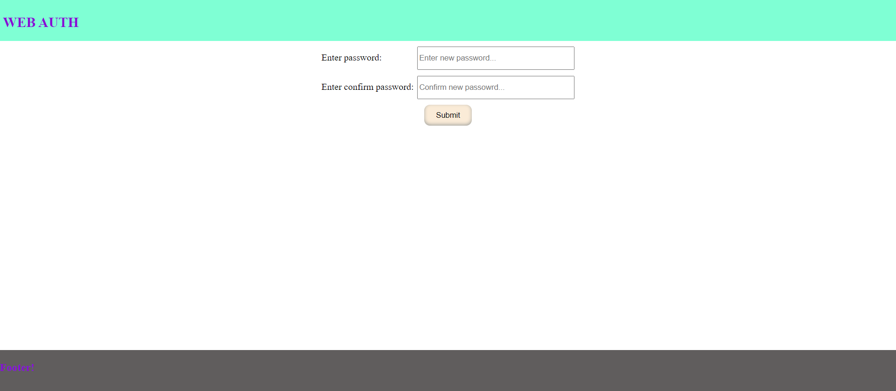

# Click on below link to see a short video on how the web auth application looks and how it works.
https://drive.google.com/file/d/1EAa6rLzQbkiM-8fVKJprtoSkaCVd-7Rs/view?usp=share_link
# About repo.

This repo contains the code for building a web authentication app that can used as a starter code for creating any new application.

I have named this application as WEB AUTH.

Technology Stack used for this project.
1. HTML(template engine ejs is used).
2. CSS
3. Javascript
4. Nodejs
5. Expressjs
6. MongoDB

Major Libraries being used in this project.
1. Passport js
2. Noty
3. Flash Message
4. Mongoose
5. Nodemailer
6. Express Session
7. Crypto
8. Bcrypt.
And many more...

## About Homepage.
It is a multipage application, which contains a homepage on which you will get the login/signin and sigup link and in case if you are logged in you will get the link to logout/signout and change password form.

## About Sign up page
Now if you click on sign up on homepage you will be redirect to signup page
Signup page contains a form which will take some value and will create you account for the web auth application.
The credentials required to create and account are
1. You name.
2. Your email id.
3. A password of your choice and,
4. A confirm password which should exactly same as password.

So once you click on password you user id will be created.

Now at the backend side, your above mentioned data will be stored in the MongoDB database where the password will be stored in encrypted form using bycrypt package.

## About Sign In page.
Now if you go to sign in page, here you will required to fill the form mentioned in the sign in page in order to login to the application.
This sign in page will require two deatils to be filled in order to login,
1. Your email id using which you have used to signed up into the application.
2. Your password which you have filled while signing up to the application.

NOTE: In case if you fill wrong email/password it will show you notification for the same.

Sign in page also contains two more links.
1. Forget password 
2. Google Signin/Signup link.

Now if you click on forget password link, it will redirect to forgetpassword page, on forget password page you have to fill you email id for which you haven't remembered the password any more.
Once you click on forget password after filling the form, a notification will pop which will notify you that a mail is sent on the mentioned password.
Now this mail contains a link to reset you password, and it can be only used once(for security purpose).

Now once you click on link mentioned in the email, you will be redirecte to another page(change password page) which i have decribed below in About change password page.

Now the Second link(Google Signin/Signup link), can be used for either for login in to web auth application using your google account or you can also signup to web auth application using your google account.

## About Change Passoword page.
You will be redirected to this page if you click on the link provided over your registered mail id.
This page contains a form which contains two fields,
1. Your New Password,
2. Confirm new password(should be same as your new password).

Once you click on submit you password will be changed and you will be redirected to sign in page again.

# Images of the WEB AUTH APP.
Homepage(when you are logged out).

Homepage(when you logged in)

Signin Page

Signup Page

Forgetpassword Page

Mail(Image of mail which will sent once you fill the form on forget password page.)

Change Password Page
